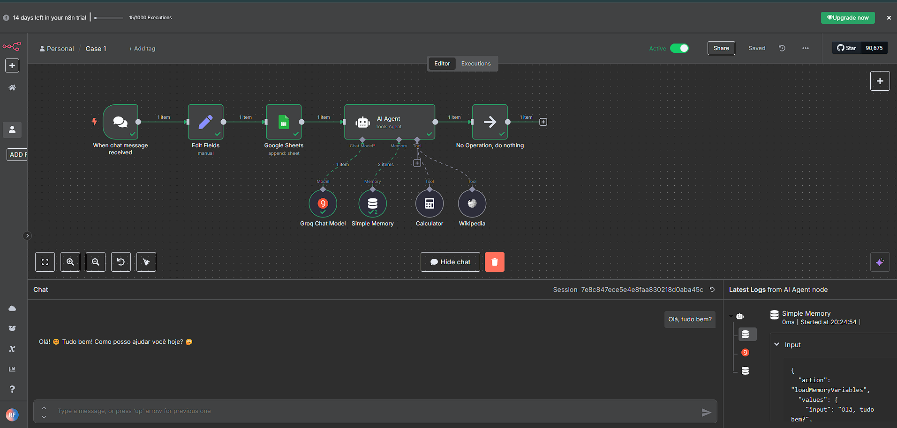
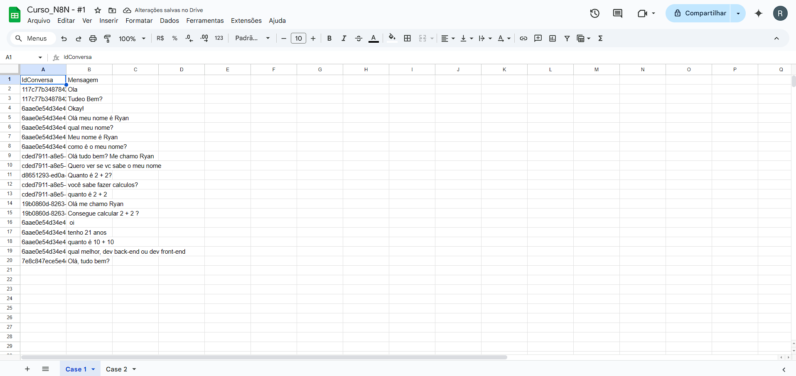

# 🤖 Automação de Chat com n8n, Groq e Google Sheets

Este projeto demonstra uma automação **low-code** criada com [n8n](https://n8n.io/), integrando mensagens de chat com IA e planilhas do Google.

## 🔧 O que essa automação faz:

1. Recebe mensagens de chat (simulado por trigger)
2. Edita os dados recebidos
3. Salva a conversa em uma planilha do Google Sheets
4. Usa IA com **Groq Chat Model** para interpretar ou responder
5. Realiza cálculos e busca informações na Wikipedia se necessário

## 🚀 Ferramentas utilizadas

- [n8n](https://n8n.io/)
- Groq Chat Model (IA)
- Google Sheets
- Simple Memory, Calculator, Wikipedia tools

## 📂 Como usar

1. Clone este repositório
2. Importe o arquivo `workflow-n8n.json` no seu n8n (`Workflows` → `Import`)
3. Conecte suas credenciais (Google Sheets, Groq etc.)
4. Execute o fluxo!

## 💡 Prints

Veja abaixo o fluxo completo criado no n8n:

---

Se quiser testar ou melhorar essa automação, fique à vontade para contribuir ou mandar sugestões! 😄

#n8n #lowcode #automacao #groq #googleSheets #inteligenciaartificial